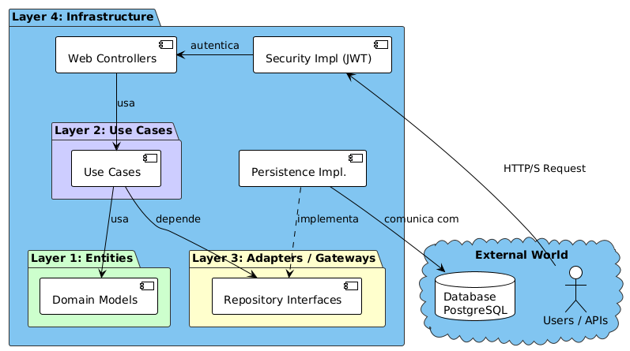
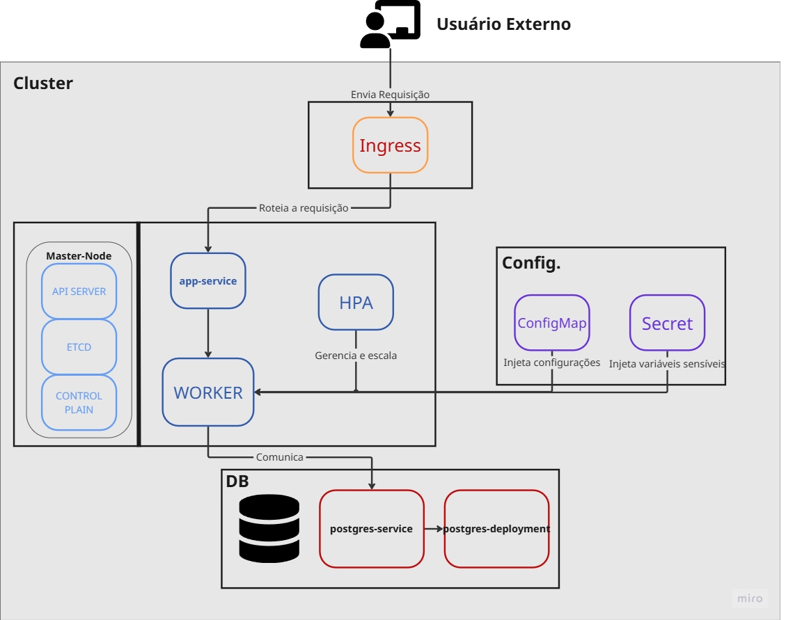

# POS TECH - Tech Challenge: Sistema de Gestão de Oficina Mecânica

Este repositório contém a primeira versão (MVP) do back-end para o **Sistema Integrado de Atendimento e Execução de Serviços** de uma oficina mecânica. O projeto foi desenvolvido como parte do "Tech Challenge" da pós-graduação POS TECH, com o objetivo de solucionar os desafios de desorganização e ineficiência enfrentados pela oficina.

O sistema foi modelado utilizando a metodologia **Domain-Driven Design (DDD)**, com um foco especial no ciclo de vida da Ordem de Serviço (OS) e suas transições de status. A aplicação é um back-end **monolítico** desenvolvido em **Java 21** e **Spring Boot**, expondo suas funcionalidades através de APIs **RESTful**.

O foco deste MVP é garantir uma gestão eficiente e segura, aplicando boas práticas de **Qualidade de Software** e **Segurança**. Isso inclui a implementação de autenticação **JWT** para APIs administrativas, validação de dados sensíveis e uma alta cobertura de testes automatizados.

### Principais Tecnologias e Ferramentas

* **Linguagem & Framework:** Java 21 e Spring Boot.
* **Banco de Dados:** PostgreSQL, com gerenciamento de migrações via Liquibase.
* **Controle de Acesso:** Autenticação via JSON Web Token (JWT) e controle de acesso baseado em papéis (RBAC).
* **Documentação:** Swagger para documentação das APIs.
* **Orquestração:** Docker e Docker Compose para facilitar o empacotamento e a execução em diferentes ambientes.
* **Testes:** JUnit e Mockito para testes unitários e de integração, garantindo a qualidade do código.
* **Comunicação:** Funcionalidade de envio de e-mails para notificações, utilizando o JavaMailSender e templates Thymeleaf.

### Entregáveis Fase 2:
Link do vídeo do Youtube:
https://www.youtube.com/watch?v=dIdenFq2bOw
adendo: https://youtu.be/W4g-jS4cXxo
---

### Entregáveis Fase 5:
Link do vídeo do Youtube:
https://www.youtube.com/watch?v=dIdenFq2bOw
adendo: https://youtu.be/W4g-jS4cXxo \
Swagger da API: https://fr4vk6f1r4.execute-api.us-east-1.amazonaws.com/Prod/swagger-ui/index.html#/
---

### Arquitetura da Aplicação:

**Componentes da Aplicação:**



**Infraestrutura provisionada:**



**Fluxo de deploy:**


### Principais Funcionalidades do MVP

* **Gestão de Ordens de Serviço (OS):** Criação, acompanhamento de status (via uma máquina de estados), geração de orçamentos e aprovação de serviços. Inclui endpoints para transições de estado como `diagnose`, `approve`, `finish`, `deliver`.
* **Gestão de Estoque:** Controle de peças e insumos, com funcionalidades de CRUD e verificação de disponibilidade para a execução de serviços.
* **Cadastros Base:** Funcionalidades de CRUD para clientes e veículos, com validação de dados sensíveis como CPF e placa.
* **Monitoramento:** Cálculo do tempo médio de execução dos serviços finalizados, com a possibilidade de aplicar filtros por data e serviços.

###  Mapeamento de Rotas

A seguir, um resumo das principais rotas da API e suas funcionalidades:

| Verbo  | Rota                                      | Descrição                                                                 |
|--------|-------------------------------------------|---------------------------------------------------------------------------|
| POST   | `/api/employees`                          | Cadastra um novo funcionário.                                             |
| POST   | `/api/auth/login`                         | Autentica um funcionário e retorna um token JWT.                          |
| POST   | `/api/customers`                          | Cadastra um novo cliente.                                                 |
| POST   | `/api/vehicles`                           | Cadastra um novo veículo.                                                 |
| POST   | `/api/tool-categories`                    | Cria uma nova categoria de ferramenta.                                    |
| POST   | `/api/stock`                              | Adiciona um novo item ao estoque.                                         |
| POST   | `/api/vehicle-services`                   | Cria um novo tipo de serviço.                                             |
| POST   | `/api/service-orders`                     | Cria uma nova Ordem de Serviço.                                           |
| GET    | `/api/service-orders/consult`             | Consulta OS por CPF ou placa do veículo.                                  |
| PATCH  | `/api/service-orders/{id}/diagnose`       | Altera o status da OS para "Em Diagnóstico".                              |
| PATCH  | `/api/service-orders/{id}/wait-for-approval` | Altera o status da OS para "Aguardando Aprovação".                       |
| PATCH  | `/api/service-orders/{id}/approve`        | Aprova o orçamento e altera o status da OS para "Aprovada".               |
| PATCH  | `/api/service-orders/{id}/execute`        | Inicia a execução do serviço, alterando o status para "Em Execução".      |
| PATCH  | `/api/service-orders/{id}/finish`         | Finaliza a OS.                                                            |
| PATCH  | `/api/service-orders/{id}/deliver`        | Entrega o veículo ao cliente.                                             |
| GET    | `/api/service-orders/average-execution-time` | Consulta o tempo médio de execução de serviços.                           |

### Gestão de Segredos

A gestão de segredos é crucial para a segurança da aplicação. Abaixo estão as instruções para configurar as variáveis de ambiente em diferentes cenários.

#### Ambiente Local (Docker Compose)

Para executar a aplicação localmente com o Docker Compose, é necessário criar um arquivo `.env` na raiz do projeto. Este arquivo não é versionado e contém as variáveis de ambiente necessárias para a aplicação.

1.  Crie um arquivo chamado `.env` na raiz do projeto.
2.  Copie o conteúdo do arquivo `.env.example` e cole no `.env`.
3.  Substitua os valores das variáveis de ambiente no arquivo `.env` com suas credenciais.

**Exemplo de arquivo `.env`:**

```
SPRING_DATASOURCE_USERNAME=postgres
SPRING_DATASOURCE_PASSWORD=password
POSTGRES_USER=postgres
POSTGRES_PASSWORD=password
SPRING_MAIL_USERNAME=seu-email@example.com
SPRING_MAIL_PASSWORD=sua-senha-de-email
```

#### Ambiente Kubernetes

Em um ambiente Kubernetes, os segredos são gerenciados através de objetos `Secret`. O arquivo `k8s/secret.yaml` define os segredos necessários para a aplicação.

Os valores dos segredos devem ser codificados em **Base64**. Para criar o segredo no Kubernetes, siga os passos abaixo:

1.  **Codifique seus segredos em Base64:**

    Você pode usar o seguinte comando para codificar cada um dos seus segredos:

    ```bash
    echo -n 'seu-valor-secreto' | base64
    ```

2.  **Atualize o arquivo `k8s/secret.yaml`:**

    Substitua os valores vazios no arquivo `k8s/secret.yaml` pelos valores codificados em Base64.

    ```yaml
    apiVersion: v1
    kind: Secret
    metadata:
      name: techchallenge-secrets
      namespace: techchallenge
    type: Opaque
    stringData:
      DB_PWD: "sua-senha-do-banco-em-base64"
      SPRING_MAIL_USERNAME: "seu-email-em-base64"
      SPRING_MAIL_PASSWORD: "sua-senha-de-email-em-base64"
    ```

### 🚀 Instruções de Uso

Siga as instruções abaixo para subir a aplicação em seu ambiente local e interagir com suas funcionalidades.

#### 1. Executando com Docker Compose

O projeto utiliza Docker e Docker Compose para orquestrar a aplicação e seu banco de dados, garantindo um ambiente de desenvolvimento consistente e de fácil configuração.

1. Certifique-se de ter o [Docker](https://www.docker.com/get-started) e o [Docker Compose](https://docs.docker.com/compose/install/) instalados em sua máquina.
2. Crie um arquivo `.env` na raiz do projeto, conforme explicado na seção **Gestão de Segredos**.
3. Navegue até a pasta raiz do projeto, onde o arquivo `docker-compose.yml` está localizado.
4. Execute o seguinte comando no terminal para construir a imagem da aplicação e subir todos os serviços:
   ```bash
   docker-compose up -d
   ```
    * O serviço `soat12_db` (banco de dados PostgreSQL) será inicializado e aguardará as conexões.
    * O serviço `soat12_app` (a aplicação Spring Boot) será construído, iniciará, e o Liquibase executará as migrações de banco de dados definidas no projeto.
5. Para parar e remover os contêineres, execute:
   ```bash
   docker-compose down
   ```

#### 2. Executando com Kubernetes

Este projeto utiliza o Minikube para criar um cluster Kubernetes local, simulando um ambiente mais próximo ao de produção e permitindo a validação das configurações de orquestração.

1. Certifique-se de ter o Docker (https://www.docker.com/get-started), o
   Minikube (https://minikube.sigs.k8s.io/docs/start/).
2. Navegue até a pasta raiz do projeto.
3. Inicie o cluster Minikube com o seguinte comando:
   ```bash
   minikube start --driver=docker
    ```
    * Este comando utiliza o Docker para criar um node Kubernetes local em sua máquina.

4. No controller do cluster deverá ser instalado algumas features. Estes são pré-requisitos para a aplicação rodar corretamente.

    * Habilita o addon do Ingress para roteamento de tráfego externo
   ```bash
   minikube addons enable ingress
    ```
5. Crie o segredo no cluster, conforme explicado na seção **Gestão de Segredos**.
6. Execute a aplicação no cluster.
    * Cria o namespace dedicado para a aplicação
   ```bash
   minikube kubectl -- create namespace techchallenge
    ```
    * Aplica todos os scripts do diretório k8s/
   ```bash
   minikube kubectl -- apply -f k8s/
    ```
    * Este passo irá criar os Deployments, Services, e outros recursos.

7. Aguarde a inicialização dos Pods. Monitore o status até que todos os pods da aplicação estejam com o status Running e READY 1/1.
   ```bash
   minikube kubectl -- get pods -n techchallenge --watch
    ```

8. Para testes locais, é necessário que seja feito um proxy para as portas do Banco de dados e da aplicação (em um novo terminal).
    ```bash
   kubectl port-forward svc/techchallenge-service 8080:8080 -n techchallenge
    ```
   #### OBS: Para estes comandos funcionarem, os terminais deverão permanecer abertos para manter o acesso à aplicação.

9. Acesse a aplicação. Após o túnel estar ativo, a aplicação estará disponível em seu navegador no seguinte endereço:
   http://127.0.0.1

10. Para encerrar e finalizar o uso do cluster basta executar o seguinte comando:
    ```bash
    minikube delete
    ```

#### 3. Provisionando a Infraestrutura com Terraform

Esta seção descreve como utilizar o Terraform para provisionar toda a infraestrutura necessária para o projeto de forma local.

1.  **Dependências do Projeto:** Certifique-se de que todos os pré-requisitos da seção anterior estejam devidamente instalados.

2.  **Instalação do Terraform:** É necessário ter o Terraform instalado em sua máquina. Siga as instruções de instalação no [site oficial da HashiCorp](https://developer.hashicorp.com/terraform/install).

#### Passos para Execução

1. Inicie o cluster Minikube com o seguinte comando:
   ```bash
   minikube start --driver=docker
    ```
    * Este comando utiliza um container minikube na sua máquina.

2.  **Navegue até a pasta `infra`** do projeto em seu terminal.

3. **Inicialize o Terraform:**
    Este comando prepara o diretório de trabalho, baixando os provedores necessários e configurando o backend.
    ```bash
    terraform init
    ```

4. **Valide a configuração:**
    Este comando faz uma verificação de sanidade para garantir que a sintaxe dos seus arquivos de configuração está tecnicamente correta.
    ```bash
    terraform validate
    ```

5.  **Gere um plano de execução:**
    Este comando cria um plano que permite visualizar as alterações (criações, atualizações, destruições) que o Terraform fará na infraestrutura. É um passo crucial para revisar e garantir que as mudanças estão corretas antes de aplicá-las.
    ```bash
    terraform plan
    ```

6.  **Aplique a configuração para criar a infraestrutura:**
    Após revisar o plano e confirmar que as alterações estão corretas, execute este comando para aplicar as mudanças. Você precisará digitar `yes` para confirmar e provisionar a infraestrutura.
    ```bash
    terraform apply
    ```
7. Aguarde o termino do terraform. Monitore o status até que todos os pods da aplicação estejam com o status Running e READY 1/1.
   ```bash
   minikube kubectl -- get pods -n techchallenge --watch
    ```

8. Se não habilitar automáticamente a porta 8080, rodar o comando abaixo.
   ```bash
   kubectl port-forward svc/techchallenge-service 8080:8080 -n techchallenge
    ```

#### Destruindo a Infraestrutura

Para remover todos os recursos criados pelo Terraform nesta configuração, utilize o comando abaixo. Ele também exibirá um plano de destruição e pedirá sua confirmação antes de prosseguir.

**Atenção:** Este comando é destrutivo e irá apagar permanentemente a infraestrutura gerenciada. Use com cuidado.

```bash
   terraform destroy
```

#### 4. FASE 2 - Fluxo de Uso da API (Caminho Feliz)

**Passo 1: Cadastro de Funcionário**

* Vá para a seção `Funcionário` no Swagger.
* Utilize o endpoint `POST /api/employees` já existe tem tipos de perfil de funcionário. Guarde o `id` retornado.
* 1 = Gestor, 2 = Mecânico, 3 = Atendente
  ```json 
  {
  "employeeFunctionId": 2,
  "cpf": "12345678901",
  "name": "João da Silva",
  "password": "senha123",
  "phone": "11999999999",
  "email": "joao@email.com",
  "active": true
  }
  ```

**Passo 2: Autenticação**

* Vá para a seção `Funcionário` no Swagger.
* Utilize o endpoint `POST /api/auth/login` para obter um token JWT.
  ```json 
  {
    "cpf": "12345678901",
    "password": "senha123"
  }
  ```

**Passo 3: Criação de ferramentas**

* Vá para a seção `Categorias de Ferramentas`.
* Use o endpoint `POST /api/tool-categories`.
  ```json 
  {
  "toolCategoryName": "Peças de Reposição",
  "active": true
  }
  ```
  ```json
  {
  "toolCategoryName": "Ferramentas Manuais",
  "active": true
  }
  ```

**Passo 4: Criar Ordem de Serviço com os dados do cliente, veículo, serviços e peças, retornando a identificação única da OS**

* Vá para a seção `Ordem de Serviço`.
* Use o endpoint `POST /api/service-orders/full` para criar uma nova OS.
* No corpo da requisição, passe todos os dados do cliente, veículo e serviços a serem criados.
* Guarde o `id` da OS criada para os próximos passos.
* employeeId = É opcional, passar apenas quando quiser quiser criar uma OS com um mecânico específico atribuído
* Notifica o mecânico que ele foi atribuído para uma nova OS

```json 
{
  "customer": {
    "cpf": "48123980027",
    "name": "Zezinho cliente teste",
    "phone": "11987654321",
    "email": "zezinho@email.com",
    "city": "São Paulo",
    "state": "SP",
    "district": "Campo Limpo",
    "street": "Avenida Doutor Manoel Palomino Fernandes",
    "number": "294"
  },
  "vehicle": {
    "licensePlate": "XCP4U38",
    "brand": "Fiat",
    "model": "Uno",
    "year": 2020,
    "color": "Prata"
  },
  "services": [
    {
      "name": "Troca do volante",
      "value": 100.0
    }
  ],
  "stockItems": [
    {
      "toolName": "Volante",
      "value": 100.00,
      "active": true,
      "quantity": 0,
      "toolCategoryId": {toolCategoryId}
    }
  ],
  "notes": "string"
}
```

**Passo 5: Consultas de OS**

**Passo 5.1: Listagem de OS ordenada por status e data de criação**

* Ordenação por status: Em Execução > Aguardando Aprovação > Diagnóstico > Recebida.
* Mais antigas primeiro.
* Excluir (lógica não física) da listagem as OS finalizadas e entregues.

* Utilizar o endpoint `GET /api/service-orders/filtered`

**Passo 5.2: Consultar status da OS por Identificador**

* Utilizar o endpoint `GET /api/service-orders/status?id=1`

**Passo 6: Aprova o Orçamento pelo sistema através de notificação externa**

* Utilizar o endpoint `GET /api/service-orders/{{SERVICE_ORDER_ID}}/webhook/approval?approval=true` altera o status da
  OS para aprovada ou recusada pelo cliente.
* A OS deve estar com o status de aguardando aprovaçao.
* Notifica o mecânico atribuído que a OS foi aprovada.

#### 5. FASE 1 - Fluxo de Uso da API (Caminho Feliz)

Após a aplicação estar em execução, você pode interagir com a API RESTful através da documentação interativa do Swagger.

1. Abra o navegador e acesse a URL do Swagger: `http://localhost:8080/swagger-ui/index.html#`.
2. Siga este "caminho feliz" para testar a funcionalidade principal do sistema:

**Passo 1: Cadastro de Funcionário**

* Vá para a seção `Funcionário` no Swagger.
* Utilize o endpoint `POST /api/employees` já existe tem tipos de perfil de funcionário. Guarde o `id` retornado.
* 1 = Gestor, 2 = Mecânico, 3 = Atendente
  ```json 
  {
  "employeeFunctionId": 2,
  "cpf": "12345678901",
  "name": "João da Silva",
  "password": "senha123",
  "phone": "11999999999",
  "email": "joao@email.com",
  "active": true
  }
  ```

**Passo 2: Autenticação**

* Vá para a seção `Funcionário` no Swagger.
* Utilize o endpoint `POST /api/employees/login` para obter um token JWT.
  ```json 
  {
    "cpf": "12345678901",
    "password": "senha123"
  }
  ```

***Passo 3: Criação dos Cadastros Base***

**Passo 3.1:  Criação de cliente**

* Vá para a seção `Cliente`.
* Use o endpoint `POST /api/customers` para criar um novo cliente. Guarde o `id` retornado.
  ```json 
  {
  "cpf": "48123980027",
  "name": "Zezinho cliente teste",
  "phone": "11987654321",
  "email": "miguel_porto@viamoc.com.br",
  "city": "São Paulo",
  "state": "SP",
  "district": "Campo Limpo",
  "street": "Avenida Doutor Manoel Palomino Fernandes",
  "number": "294"
  }
  ```

* Vá para a seção `Veículo`.

**Passo 3.2: Veiculo**

* Vá para a seção `Veículo`.
* Use o endpoint `POST /api/vehicle` para criar um novo veículo. Guarde o `id` retornado.
  ```json 
  {
  "licensePlate": "XCP4U38",
  "brand": "Fiat",
  "model": "Uno",
  "year": 2020,
  "color": "Prata"
  }
  ```

**Passo 3.3: Criação de ferramentas**

* Vá para a seção `Categorias de Ferramentas`.
* Use o endpoint `POST /api/tool-categories`.
  ```json 
  {
  "toolCategoryName": "Peças de Reposição",
  "active": true
  }
  ```
  ```json
  {
  "toolCategoryName": "Ferramentas Manuais",
  "active": true
  }
  ```

**Passo 3.4: Estoque**

* Vá para a seção `Estoque`.
* Use o endpoint `POST /api/stock` para criação de item no estoque.
  ```json 
  {
  "toolName": "Volante",
  "value": 100.00,
  "active": true,
  "quantity": 3,
  "toolCategoryId": 1
  }
  ```

**Passo 3.5: Serviço da oficina**

* Vá para a seção `Serviço`.
* Use o endpoint `POST /api/vehicle-services` para criação de serviço. Guarde o `id` retornado.
  ```json 
  {
  "name": "Troca do volante",
  "value": 100.0
  }
  ```

**Passo 4: Criação da Ordem de Serviço (OS)**

* Vá para a seção `Ordem de Serviço`.
* Use o endpoint `POST /api/service-orders` para criar uma nova OS.
* No corpo da requisição, utilize os `ids` do cliente, veículo, mecânico e serviço criados anteriormente.
* Guarde o `id` da OS criada para os próximos passos.
* employeeId = É opcional, passar apenas quando quiser quiser criar uma OS com um mecânico específico atribuído
* Notifica o mecânico que ele foi atribuído para uma nova OS

```json 
{
  "customerId": 1,
  "vehicleId": 1,
  "employeeId": 1,
  "notes": "Cliente precisa que o serviço seja feito com urgência",
  "services": [
    {
      "serviceId": 1
    }
  ],
  "stockItems": [
    {
      "stockId": 1,
      "requiredQuantity": 1
    }
  ]
} 
```

**Passo 5: Consultas de OS**

**Passo 5.1: Consultar OS por CPF**

* Utilizar o endpoint `GET /api/service-orders/consult?document=48123980027`

**Passo 5.2: Consultar OS por Placa do Veículo**

* Utilizar o endpoint `GET /api/service-orders/consult?licensePlate=XCP4U38`

***Passo 6: Fluxo de Status da OS***

**Passo 6.1: Alterar para em diagnóstico**

* Utilizar o endpoint `PATCH  /api/service-orders/{{SERVICE_ORDER_ID}}/diagnose?employeeId=1` altera a status da OS para em diagnóstico.
* employeeId = É opcional, passar apenas quando quiser associar à um mecânico específico.
* Quando não é passado, é atribúido ao mecânico com menos OS na fila.
* Se houver mecânicos com a mesma quantidade é atribuído ao mais antigo.

**Passo 6.2: Aguardar Aprovação do Cliente**

* Utilizar o endpoint `PATCH /api/service-orders/{{SERVICE_ORDER_ID}}/wait-for-approval` altera a status da OS para aguardando aprovação do cliente.

**Passo 6.3: Aprovação de Orçamento**

* Utilizar o endpoint `PATCH /api/service-orders/{{SERVICE_ORDER_ID}}/approve?employeeId=1` altera o status da OS para aprovada pelo cliente.
* Quando a aprovação for feita pela Atendente e não pelo cliente pode ser passado o `employeeId` para já associar para um mecânico específico
* Notifica o mecânico atribuído que a OS foi aprovada

**Passo 6.4: Iniciar Execução do Serviço**

* Utilizar o endpoint `PATCH /api/service-orders/{{SERVICE_ORDER_ID}}/execute` altera o status da OS para Em execução.

**Passo 6.5: Finalizar OS**

* Utilizar o endpoint `PATCH /api/service-orders/{{SERVICE_ORDER_ID}}/finish` altera o status da OS para Finalizada.
* É enviado um E-mail ao cliente avisando que foi terminado o serviço e notifica a atendente.

**Passo 6.6: Entregar o veículo**

* Utilizar o endpoint `PATCH /api/service-orders/{{SERVICE_ORDER_ID}}/deliver` altera o status da OS para Entregue.

**Passo 7: Consultar Tempo Médio de Execução do serviço**

* Utilizar o endpoint `GET  /api/service-orders/average-execution-time?serviceIds=1` altera o status da OS para Entregue.
* Esse endpoint tem parâmetros opcionais como "startDate", "endDate" e lista de "serviceIds" 

